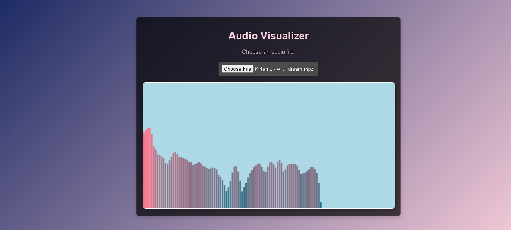

  
  
  
  

<h1 align="center">🎧 Simple Audio Visualizer</h1>

A fun and interactive web-based audio visualizer using HTML, CSS, and JavaScript.

---

## 📌 What It Does

- Upload an audio file (`.mp3`, `.wav`, etc.)
- Watch real-time colorful bar visualizations
- Powered by the **Web Audio API**
- Clean and responsive design

---

## 🚀 How to Run

1. Download or clone this repo.
2. Open `index.html` in your browser.
3. Choose an audio file and enjoy the visuals!

---

## 📁 Files Used

├── index.html # User interface and structure
├── index.js # JavaScript for audio handling and drawing

> 🎨 No external stylesheets – styling is done via internal CSS.

---

## 🧠 Behind the Scenes

This project uses:
- `FileReader` to read audio files
- `AudioContext` to decode audio
- `AnalyserNode` to extract frequency data
- `Canvas API` to render animated bars

---

## 📷 Preview

  

---

## 📄 License

This project is open-source.

---

<b>🎶 Let your music dance on screen!</b>

